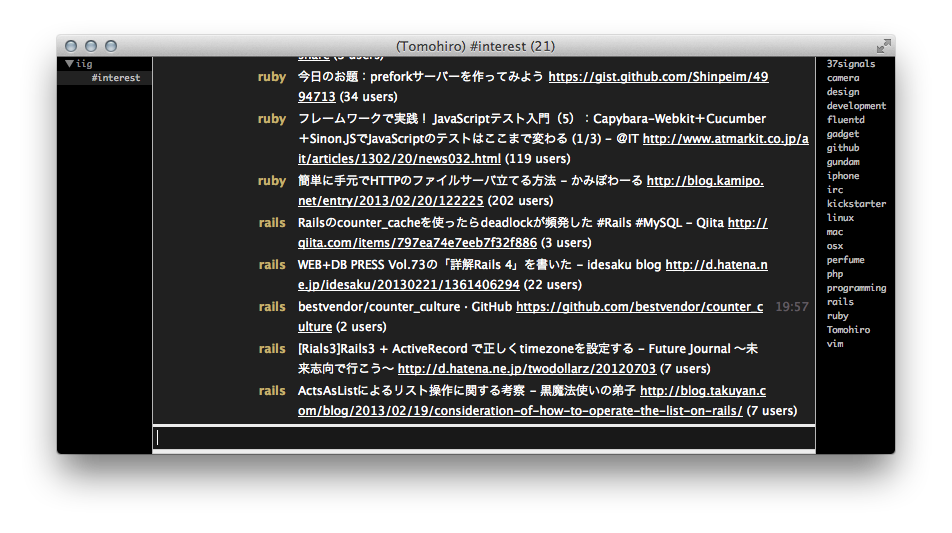

IIG [](http://stillmaintained.com/Tomohiro/iig)
================================================================================

HatenaBookmark Interest IRC Gateway

[](https://travis-ci.org/Tomohiro/iig) 
[](https://gemnasium.com/Tomohiro/iig)
[](https://codeclimate.com/github/Tomohiro/iig)




Requirements
-------------------------------------------------------------------------------

- Ruby 1.9.3 or later


Installation
--------------------------------------------------------------------------------

### Bundler

```sh
$ git clone git://github.com/Tomohiro/iig.git
$ cd iig
$ bundle install --path vendor/bundle
```


Usage
--------------------------------------------------------------------------------

### Start the IIG server

```sh
$ bundle exec iig
```

Example: Change listen IP address, port.

```sh
$ bundle exec iig --server 192.168.10.1 --port 16667
```


### Connect the IIG

1. Launch a IRC client.(Limechat, irssi, weechat...)
2. Connect the server


#### Server options

If you want check the command-line options, following type command. 

```sh
$ bundle exec iig --help
```

Option       | Value                              | Default
-----------  | ---------------------------------- | ----------
-p, --port   | Port number to listen              | 16704
-s, --server | Host name or IP address to listen  | localhost
-w, --wait   | Wait SECONDS between retrievals    | 3600(sec)
-l, --log    | Log file                           | STDOUT


#### IRC Client options

Setting server properties.

Option    | Value
--------- | ------------------
Real name | Hatena username
Password  | Hatena password


### Channels

Channel     | Description                     | Auto join
----------- | ------------------------------- | ---------
`#interest` | HatenaBookmark Interest entries | yes


LICENSE
--------------------------------------------------------------------------------

&copy; 2013 Tomohiro TAIRA.
This project is licensed under the MIT license.
See LICENSE for details.
